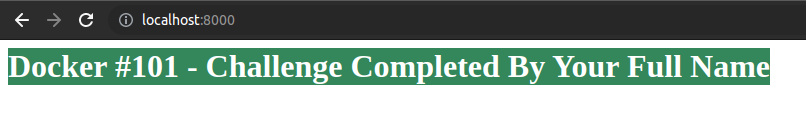

### Challenge : Run Container For HTML Page

---

- Build docker image with following HTML contents.

- Publish that image on your Docker Hub Account.
- Share that image name with me. 
- When I will run container with that image. It should print same output as above.

---